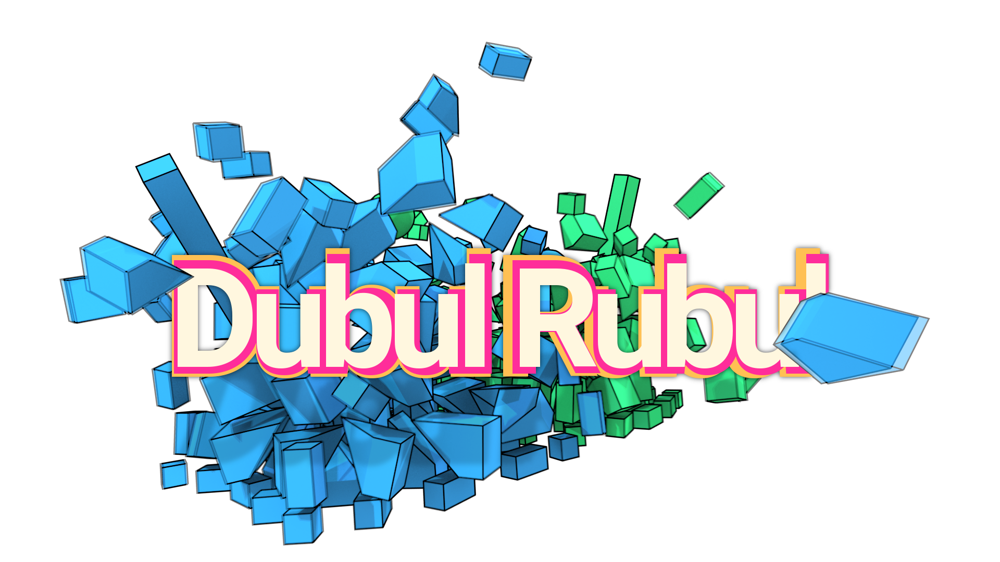
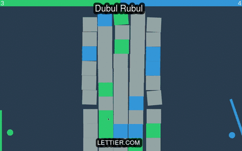

## Description

A dual-sided, breakout-like 2D game using PhysicsJS, PubSubJS, EaselJS, and FunctionalJS.
Playable at [lettier.com](http://www.lettier.com/dubulrubul).

## Gameplay Preview



## Write-up

Visit [lettier.github.io](https://lettier.github.io/posts/2016-05-12-make-a-html5-canvas-game-with-physics.html)
for a full how-to on the making of Dubul Rubul.

## Get Started

```bash
git clone git@github.com:lettier/dubulrubul.git
cd dubulrubul
# Install nvm and npm.
nvm use
npm install
```

(C) 2016 David Lettier  
http://www.lettier.com/
